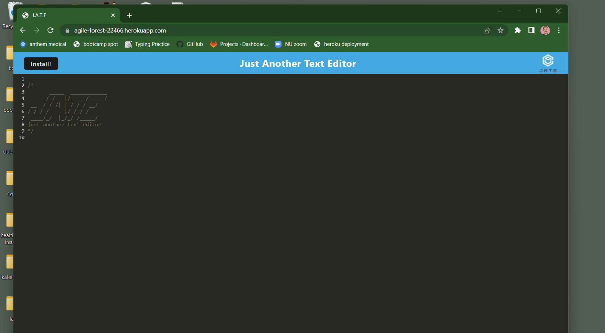

  

  # PWA Text Editor - Challenge 19

  ## Description: 
  Our assignment was to create a progressive web app in the form of a text editor. The goal was to have the app store data in the cache and be downloadable to function offline with the saved data too. I am still working on the service worker connection and enabling offline functionality. Coming soon!

  

  [LIVE LINK to deployed heroku site](https://agile-forest-22466.herokuapp.com/)

  ## Table of Contents:
  - [Description](#description)
  - [Usage](#usage)
  - [Contributions](#contributions)
  - [Testing](#testing)
  - [Questions](#questions)
  - [License](#license)

  ## Usage
  Feel free to visit [my deployed Heroku site to experience this app.](https://agile-forest-22466.herokuapp.com/)
  
  ## Contributions
  I used starter code provided by our instructors as well as a great deal of code from class assignments, adjusted to suit this context. I also collaborated with the members of my study group: Matthew Bronstein, Jordan Harris, Leah Roman, and Joseph Ruiz on certain conceptual elements.

  ## Questions
  Feel free to check out my GitHub page at: 
   https://github.com/tyleresselman

  And you can contact me directly via email at the following address: 
   [tme91302@gmail.com](mailto:tme91302@gmail.com)

  ## License
  I used The MIT License as the license for this project. Please follow this link if you want to learn more: https://opensource.org/licenses/MIT